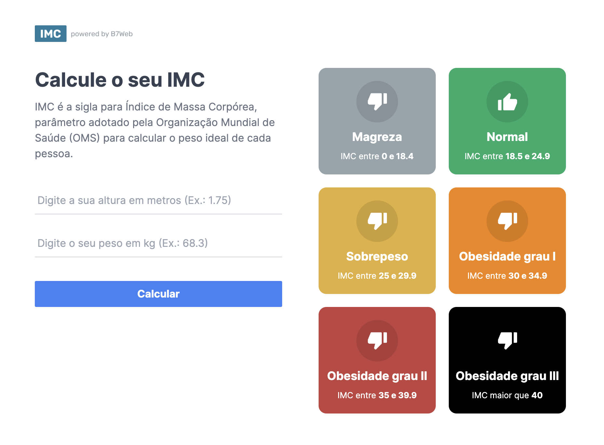
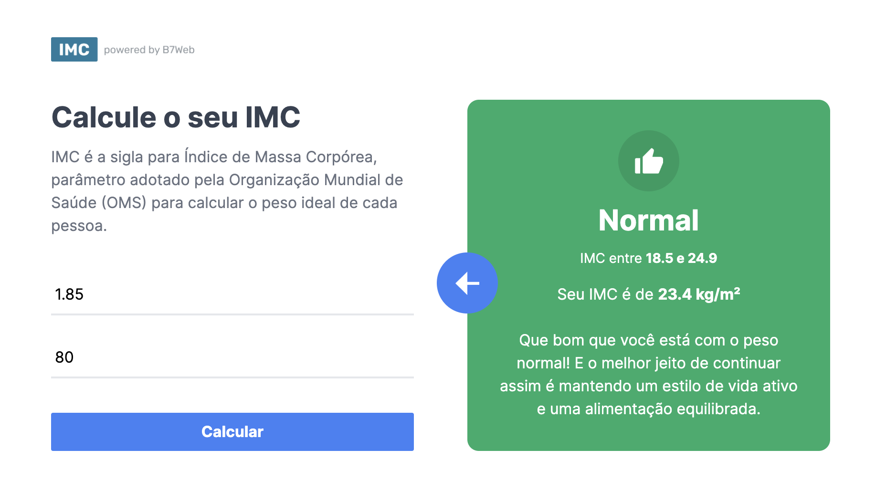

#  Calculadora de IMC

Este é um projeto de uma Calculadora de IMC desenvolvida em React e TypeScript no curso de React do B7Web. Com ela é possível calcular o Índice de Massa Corporal (IMC) de uma pessoa com feedback de sua classificação dentro da tabela IMC.




## 🔗 Acesse o deploy da aplicação
[](https://calculadora-imc-b7web.vercel.app/)

## 🛠️ Tecnologias
- [Next.js](https://nextjs.org/)
- [TypeScript](https://www.typescriptlang.org/)
- [React](https://react.dev/)
- [Tailwind CSS](https://tailwindcss.com/)

## 💻 Rodando o projeto localmente
```bash
# Clone este repositório
$ git clone https://github.com/welisonw/calculadora-imc.git

# Entre na pasta do projeto
$ cd calculadora-imc

# Instale as dependências
$ npm install  ou  yarn install

# Inicie o projeto
$ npm run dev  ou  yarn run dev

# O app vai inicializar em http://localhost:3000
```
